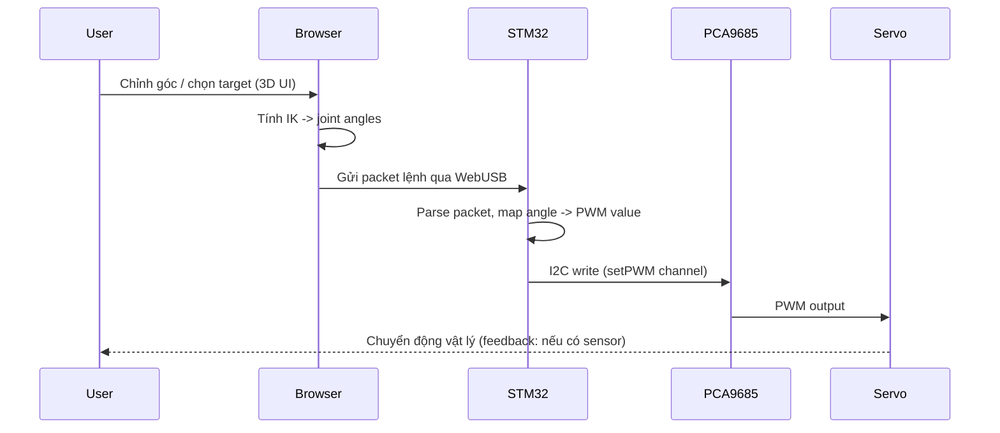

# Tóm tắt dự án & phương pháp (Markdown)

## 1. Tóm tắt ngắn gọn

**Tên dự án:** Cánh tay robot 3 bậc tự do (3DOF) — điều khiển qua giao diện web tương tác.
**Mục tiêu:** Xây dựng hệ thống cho phép người dùng điều khiển cánh tay robot 3DOF (base, arm1, arm2) bằng giao diện web 3D (Three.js + URDF loader). Tính toán động học (FK/IK) và giao diện chạy trên trình duyệt; lệnh điều khiển truyền tới **STM32F103C8T6** qua **WebUSB/USB OTG**, MCU chuyển tiếp lệnh tới module PWM (**PCA9685**) qua **I2C** để điều khiển servo vật lý. Hiện trạng: mô hình URDF & giao diện web đã hoàn thiện, cơ khí đã lắp đặt; **firmware STM32 chưa triển khai**.

---

## 2. Kiến trúc hệ thống (Mermaid — component diagram)

```mermaid
flowchart LR
  subgraph Browser
    UI[Three.js Web UI<br/>(URDF Loader)]
    IK[Client-side FK / IK]
    WebUSB[WebUSB API]
  end

  PC[Máy tính / Host Browser]

  STM[STM32F103C8T6<br/>(USB device)]
  I2CMod[PCA9685<br/>(PWM via I2C)]
  Servo[Servo motors<br/>(base, arm1, arm2)]

  UI --> IK
  IK -->|angles (θ_base, θ_arm1, θ_arm2)| WebUSB
  WebUSB -->|USB OTG / CDC or custom| STM
  STM -->|I2C (setPWM)| I2CMod
  I2CMod -->|PWM signals| Servo

  classDef hw fill:#f3f4f6,stroke:#333;
  class STM,I2CMod,Servo hw;
```

---

## 3. Luồng điều khiển (Mermaid — sequence diagram)



---

## 4. Phương pháp (các bước chính)

1. **Thiết kế & mô phỏng**

   * Dựng mô hình robot 3DOF (base, arm1, arm2) thành URDF.
   * Kiểm thử kinematics trong PyBullet / MuJoCo (nạp URDF, thử chuỗi chuyển động).
   * Placeholder hình: `[Hình: Mô hình URDF trong PyBullet]`.

2. **Giao diện web**

   * Hiển thị URDF bằng Three.js + URDF loader.
   * Hiện điều khiển (sliders / manipulators) cho 3 khớp.
   * Tính toán FK/IK trên client (JS) khi người dùng tương tác.
   * Placeholder: `[Hình: Giao diện Three.js với sliders]`.

3. **Phần cứng**

   * Board: STM32F103C8T6 (Blue Pill).
   * PWM driver: PCA9685 (I2C).
   * Servo: 3 servo cho base, arm1, arm2; nguồn tách riêng cho servo.
   * Placeholder: `[Hình: Sơ đồ đấu nối STM32 - PCA9685 - Servo]`.

4. **Firmware (cần thực hiện)**

   * Implement USB device (CDC/WebUSB compatible) để nhận packet từ trình duyệt.
   * Implement I2C driver + hàm map angle -> PWM (servo calibration).
   * Safety: giới hạn góc, timeout, emergency stop.
   * Placeholder code block: `[Code: Khung firmware STM32 (USB receive -> I2C write)]`.

5. **Tích hợp & kiểm thử**

   * Test từng tầng (USB ↔ STM32, STM32 ↔ PCA9685, PCA9685 ↔ Servo).
   * Test end-to-end: Browser -> Robot, đo latency và sai số góc.
   * Thu thập log: thời gian truyền, thời gian xử lý MCU, phản hồi servo.

---

## 5. Output (sản phẩm mong đợi)

* **Sản phẩm phần mềm**

  * Web UI tương tác (Three.js + URDF loader) với khả năng xuất joint angles.
  * Firmware STM32 nhận lệnh qua USB và điều khiển PCA9685 qua I2C.

* **Sản phẩm phần cứng**

  * Cánh tay robot 3DOF lắp ráp hoàn chỉnh và chạy servo theo lệnh.

* **Tài liệu**

  * Báo cáo IMRaD đầy đủ, bao gồm mô tả thiết kế, mã nguồn khung (placeholders), hình ảnh mô phỏng & thực tế, và hướng dẫn chạy thử.

* **Bộ đo & tiêu chí đánh giá** (cần đo thực tế, chưa có số liệu)

  * Tính đúng đắn: góc thực tế của mỗi khớp khớp với góc mô phỏng (đo sai số góc).
  * Độ trễ end-to-end (Browser → servo bắt đầu chuyển động).
  * Ổn định: jitter, rung, drift sau thời gian vận hành.
  * An toàn: hành vi khi mất tín hiệu/timeout.

> Lưu ý: **không có số liệu thực nghiệm** trong báo cáo hiện tại vì firmware chưa triển khai — mọi giá trị đo cần đo trực tiếp sau khi hoàn thiện firmware.

---

## 6. Kế hoạch ngắn hạn (next steps, ưu tiên)

1. **Ưu tiên cao:** Viết và nạp firmware STM32 (USB receive + I2C setPWM + safety).
2. Tích hợp end-to-end: kiểm thử WebUSB → STM32 → PCA9685 → Servo.
3. Hiệu chỉnh (calibrate) map góc ↔ PWM cho từng servo.
4. Thu thập dữ liệu thử nghiệm và điền vào phần Kết quả báo cáo: latency, sai số, hình ảnh/clip demo.
5. Bổ sung tính năng: feedback sensor (optional encoder hoặc potentiometer) để có control đóng vòng.

---

## 7. Placeholder tài nguyên cần thu thập cho báo cáo

* Ảnh mô hình URDF trong mô phỏng: `[Hình 1: URDF / PyBullet]`
* Ảnh robot thực tế (toàn bộ và close-up khớp): `[Hình 2: Robot lắp ráp]`
* Sơ đồ nối dây điện/electrical schematic: `[Hình 3: Schematic STM32-PCA9685-Servos]`
* Biểu đồ đo (latency, error): `[Hình 4: Biểu đồ latency & sai số]`
* Đoạn mã khung (firmware, WebUSB): `[Code 1], [Code 2], [Code 3]`